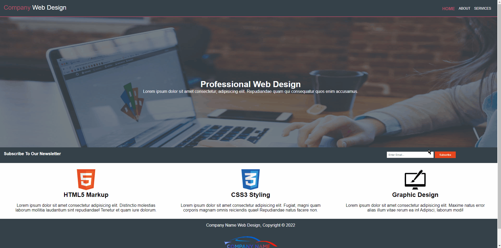

# COMPANY WEB DESIGN (HTML+CSS)



## Description
This project aimed to connect multiple sites and create a resposive site with display-flex.

## Project Skeleton 

```
COMPANY-WEB-DESIGN(folder)
|
|----README.md
|----Img (folder)
|----index.html
|----style.css
|----about.html
|----serveces.html

## What I used in this project?

- ## Html
  - ### Form
- ## Css
  - ### Display Flex 

<left> ⌛ Happy Coding  💻🎶🍕🍀✍ </left>